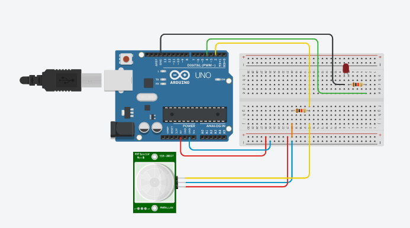

# inp-sys
組込みシステム実験の自由課題用リポジトリ
## 環境構築の手順
### git clone
お好きなディレクトリに移動して
```
git clone https://github.com/smaru1111/inp-sys
```
### hum_a
arduino用のフォルダ<br>
以下の配線図のように配線をする。<br>
<br>
配線出来たらコンパイルして実行。<br>
### hum_p
processing用のフォルダ<br>
以下の記事を参考にして、**LINEトークルームのトークン発行まで**して、発行されたトークンをメモ帳等に控える。<br>
[LINE Notifyをnode.jsで利用する](https://dev.classmethod.jp/articles/line-notify/)<br>
inp-sys直下に`.env`ファイルを作り、先ほど用意したトークン文字列をセットする。<br>
```
//例
LINE_NOTIFY_TOKEN=hogehogehogehoge
```
セット出来たら、コンパイルして実行。
